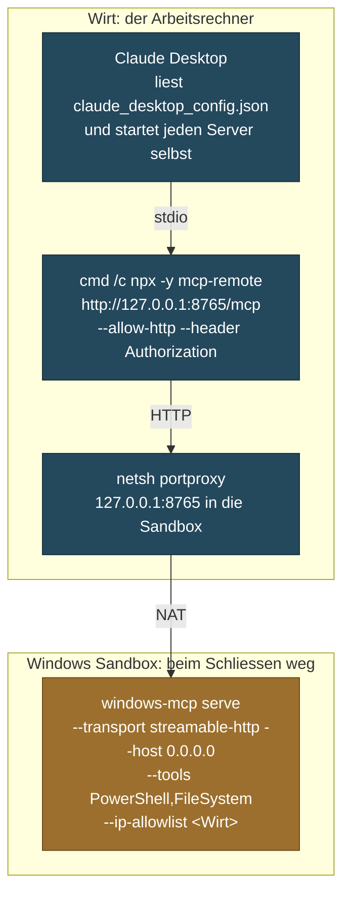

# MCP in der Windows Sandbox

Ein MCP-Server mit vollem Systemzugriff gehoert nicht auf den Rechner, auf dem
die Arbeit liegt. Hier laeuft er in einer Windows Sandbox, die beim Schliessen
verschwindet, und Claude Desktop kommt trotzdem daran.

**Mit allen elf Fehlversuchen, die dazwischen lagen.** Die sind der
eigentliche Inhalt dieses Dokuments.

| | |
|---|---|
| Gebaut | September 2026 |
| `windows-mcp` | 4.0.3 |
| Protokoll | MCP 2025-06-18, Transport `streamable-http` |
| Wirt | Windows 11 |

---

## Das Problem

Ein Cloud-Assistent verlor durch ein Windows-Update seine Shell-Anbindung an den
lokalen Rechner. Was fehlte, waren drei Dinge: **loeschen, umbenennen, Befehle
ausfuehren.** Dateien lesen und schreiben ging weiter, ausfuehren nicht.

Fuer Windows gibt es einen fertigen MCP-Server, der genau das zurueckgibt, und
eine fertige Erweiterung dafuer. Sie zu installieren dauert zwei Minuten.
Danach hat der Assistent `PowerShell`, `FileSystem`, `Registry`, `Process` und
zwoelf weitere Werkzeuge **auf dem Arbeitsrechner**.

Die Sicherheitshinweise des Projekts nennen selbst, wo man es *nicht* einsetzen
soll: Arbeitsplatzrechner, Systeme mit sensiblen Daten, geteilte Systeme.
Empfohlen wird eine VM mit Snapshot oder die Windows Sandbox.

> **Was ein Werkzeug nicht koennen muss, soll es nicht koennen. Und wo ein
> Fehlgriff nichts kostet, ist der bessere Ort dafuer.**

### Warum die fertige Erweiterung es nicht loest

Sie kennt zwei Betriebsarten:

- **`local`** laesst den Server **auf dem Arbeitsrechner** laufen. Ihre
  Werkzeugliste in den Einstellungen ist eine reine **Anzeige ohne Schalter**:
  alles oder nichts.
- **`remote`** meint nicht die eigene Sandbox, sondern einen gehosteten
  Fremddienst mit eigenem Konto und API-Schluessel.

Der eigene Server kann beides, was gebraucht wird: er spricht HTTP, und
`--tools` beschraenkt ihn auf einzelne Werkzeuge.

---

## Die Kette



Vier Glieder, zwei Welten. Der Vermittler ist noetig, weil die lokale
MCP-Konfiguration keine blosse Adresse annimmt. Die Portweiterleitung ist
noetig, weil die Sandbox bei jedem Start eine andere IP bekommt.

---

## Der Aufbau

### 1. Zwei Ordner in der Sandbox-Konfiguration

Einer **nur lesbar** mit Skripten und Arbeitsstand, einer **beschreibbar** fuer
Ergebnisse. Der zweite ist der einzige Weg, eine Erkenntnis aus der Sandbox
herauszubekommen.

`LogonCommand` ist der entscheidende Teil: damit baut sich die Sandbox beim
Anmelden selbst auf.

```xml
<Configuration>
  <MemoryInMB>16384</MemoryInMB>
  <Networking>Default</Networking>
  <ProtectedClient>Enable</ProtectedClient>
  <MappedFolders>
    <MappedFolder>
      <HostFolder>S:\SandboxShare</HostFolder>
      <SandboxFolder>C:\Users\WDAGUtilityAccount\Desktop\Austausch</SandboxFolder>
      <ReadOnly>true</ReadOnly>
    </MappedFolder>
    <MappedFolder>
      <HostFolder>S:\SandboxErgebnisse</HostFolder>
      <SandboxFolder>C:\Users\WDAGUtilityAccount\Desktop\Ergebnisse</SandboxFolder>
      <ReadOnly>false</ReadOnly>
    </MappedFolder>
  </MappedFolders>
  <LogonCommand>
    <Command>powershell.exe -ExecutionPolicy Bypass -NoExit -File "C:\Users\WDAGUtilityAccount\Desktop\Austausch\start.ps1"</Command>
  </LogonCommand>
</Configuration>
```

> **Der Ergebnisordner muss vorher existieren.** Fehlt er, startet die Sandbox
> gar nicht erst.

### 2. Das Startskript in der Sandbox

```powershell
# Der Wirt ist das Standardgateway der Sandbox.
$gateway = (Get-NetRoute -DestinationPrefix "0.0.0.0/0" |
            Sort-Object RouteMetric | Select-Object -First 1).NextHop

# Die Firewallregel lebt nur, solange die Sandbox lebt.
New-NetFirewallRule -DisplayName "MCP 8765" -Direction Inbound `
    -LocalPort 8765 -Protocol TCP -Action Allow | Out-Null

# Der Schluessel kommt aus der Umgebung, nie aus der Befehlszeile:
# eine Befehlszeile steht in der Prozessliste.
$env:WINDOWS_MCP_AUTH_KEY = (Get-Content "$Austausch\schluessel.txt" -Raw).Trim()

uvx windows-mcp serve --transport streamable-http --host 0.0.0.0 `
    --port 8765 --tools PowerShell,FileSystem --ip-allowlist $gateway
```

**Die eigene Adresse gehoert in den Ergebnisordner**, geschrieben *bevor* der
Server startet, denn danach blockiert das Skript.

Gemessen an drei aufeinanderfolgenden Starts: `172.31.192.74`,
`172.31.206.101`, `172.31.206.111`.

> **Berichtigung, 15.09.2026.** Hier stand, das Standardgateway bleibe dabei
> stabil. Das galt fuer drei Starts hintereinander und gilt **nicht** ueber
> einen Neustart des Wirts hinweg. Danach zog das ganze Teilnetz um, von
> `172.31.x` auf `172.23.x`, Gateway vorher `172.31.192.1`, nachher
> `172.23.160.1`. Schaden entsteht nur dann keiner, wenn das Gateway bei jedem
> Lauf frisch aus `Get-NetRoute` geholt wird und nirgends als feste Zahl im
> Skript steht. **Drei gleiche Messungen aus derselben Lage sind kein Beweis
> fuer eine Regel.**

### 3. Die Portweiterleitung auf dem Wirt

Ohne sie muesste nach jedem Sandbox-Start die Konfigurationsdatei neu
geschrieben werden, und das ist die fehleranfaelligste Stelle des ganzen Aufbaus.

```powershell
netsh interface portproxy delete v4tov4 listenaddress=127.0.0.1 listenport=8765
netsh interface portproxy add v4tov4 listenaddress=127.0.0.1 listenport=8765 `
      connectaddress=<Sandbox-IP> connectport=8765
```

Sie lauscht nur auf `127.0.0.1` und ist von aussen nicht erreichbar. Sie
ueberlebt einen Neustart des Wirts und zeigt dann ins Leere, bis die Sandbox
wieder laeuft. `netsh interface portproxy show v4tov4` listet alle auf.

### 4. Der Eintrag in Claude Desktop

Bei einer Installation **aus dem Microsoft Store** liegt die Konfiguration
nicht unter `%APPDATA%\Claude`, sondern im Paket-Container:

```
%LOCALAPPDATA%\Packages\Claude_<Paket-Id>\LocalCache\Roaming\Claude\claude_desktop_config.json
```

```json
{
  "mcpServers": {
    "windows-mcp-sandbox": {
      "command": "cmd",
      "args": [
        "/c", "npx", "-y", "mcp-remote",
        "http://127.0.0.1:8765/mcp",
        "--allow-http",
        "--header", "Authorization: Bearer <Schluessel>"
      ]
    }
  }
}
```

### 5. Pruefen, bevor man sich freut

Ein Portklopfer beweist nur, dass etwas lauscht. Der Nachweis ist ein echter
Werkzeugaufruf, dessen Antwort selbst sagt, **wo** er gelaufen ist:

```
Server:  windows-mcp 4.0.3
2 Werkzeuge:
  PowerShell   Shell/command execution …
  FileSystem   Manages file system operations …

tools/call PowerShell → $env:COMPUTERNAME; $env:USERNAME
C2E98CD1-EBE7-4
WDAGUtilityAccount
```

**Zwei** Werkzeuge heisst: die Beschraenkung greift.
**`WDAGUtilityAccount`** heisst: der Befehl lief in der Sandbox.
Achtzehn Werkzeuge hiessen: es ist der Server auf dem Arbeitsrechner.

---

## Die elf Fehlversuche

Jeder wurde erst sichtbar, nachdem der vorige behoben war.

```mermaid
flowchart TD
    A1{"Konfigurationsdatei<br/>unter %APPDATA%?"} -->|nein| A1F["Store-App: sie liegt im<br/>Paket-Container unter<br/>%LOCALAPPDATA%\Packages"]
    A1F --> A2{"Suche mit -Depth 3<br/>findet nichts"}
    A2 -->|zu flach| A2F["Sie liegt fuenf Ebenen tief.<br/>Ein Nichtfund bei begrenzter<br/>Tiefe ist kein Beweis"]
    A2F --> A3{"Eintrag geschrieben"}
    A3 -->|"is not valid JSON"| A3F["Set-Content schrieb ein BOM.<br/>Die Pruefung sagte 'identisch',<br/>weil PowerShell darueber hinwegliest"]
    A3F --> A4{"type/url angenommen?"}
    A4 -->|"uebersprungen"| A4F["Die lokale Konfiguration will<br/>command und args, keine Adresse"]
    A4F --> A5{"npx gefunden"}
    A5 -->|"npx.ps1"| A5F["Ein PowerShell-Skript ist<br/>keine ausfuehrbare Datei"]
    A5F --> A6{"npx.cmd als command"}
    A6 -->|"Connection closed"| A6F["Eine Batch-Datei ohne<br/>Interpreter startet nicht.<br/>cmd /c npx loest es"]
    A6F --> A7{"laeuft er jetzt?"}
    A7 -->|"Non-HTTPS URLs"| A7F["--allow-http fehlte.<br/>Damit erledigt sich die<br/>ganze Zertifikatsfrage"]
    A7F --> ZIEL(["Shell in der Sandbox"])

    classDef f fill:#9c3a2e,stroke:#6b2820,color:#fff
    classDef g fill:#3f6b4a,stroke:#2a4a32,color:#fff
    class A1F,A2F,A3F,A4F,A5F,A6F,A7F f
    class ZIEL g
```



### 1. Die Pruefung lief im falschen Fenster

Ein `Test-NetConnection` von der Sandbox zur Sandbox meldete `True`. Sichtbar
wurde es nur an einem Detail:

```
SourceAddress : 172.31.192.74
RemoteAddress : 172.31.192.74
```

> **Eine Pruefung, die von sich selbst zu sich selbst geht, prueft nichts.**

Seither gibt jeder solche Befehl `$env:COMPUTERNAME` mit aus.

### 2. Der geplante Test mass das Falsche

Geplant war eine Pruefung auf **Port 445**. Das misst SMB, nicht den Weg. Ein
Nein haette zwei Ursachen haben koennen, Netz zu oder SMB aus, und waere nicht
verwertbar gewesen.

**Stattdessen:** in der Sandbox einen eigenen Lauscher auf einem freien Port
hinstellen und gegen diesen pruefen.

### 3. Die Freigabe zeigte einen Mischzustand

Nach Aenderungen auf dem Wirt sah die **laufende** Sandbox: eine Datei neu, eine
als `.tmp`-Zwischendatei, eine ganz fehlend, eine im alten Stand. Auf dem Wirt
war alles korrekt.

**Die nur lesbare Freigabe wird nicht zuverlaessig nachgefuehrt.** Aenderungen
brauchen einen Neustart der Sandbox.

### 4. Sandbox und Wirt sehen im Terminal gleich aus

Dreimal an einem Abend landete ein Befehl im falschen Fenster. Kein
Bedienfehler, ein Aufbaufehler.

**Behoben durch** `$host.ui.RawUI.WindowTitle` und einen farbigen Kopf mit
Rechner- und Benutzername ganz oben im Startskript.

### 5. Die Konfigurationsdatei lag woanders

Gesucht unter `%APPDATA%\Claude`. Der Ordner existierte nicht einmal.

**Eine Installation aus dem Microsoft Store** schreibt in ihren Paket-Container
unter `%LOCALAPPDATA%\Packages\`.

### 6. Die Suche war zu flach

Eine rekursive Suche mit `-Depth 3` fand nichts. Die Datei liegt fuenf Ebenen
tief. Auf dieses Nichtergebnis hin wurde ein funktionierendes Skript als
Sackgasse gesperrt.

> **Ein Nichtfund bei begrenzter Suchtiefe ist kein Beweis fuer
> Nichtexistenz.**

### 7. Ein unsichtbares Byte-Order-Mark

```
App-Einstellungen konnten nicht geladen werden:
Unexpected token … is not valid JSON
```

`Set-Content -Encoding UTF8` schreibt in PowerShell 5.1 ein BOM an den
Dateianfang. Die Pruefung direkt danach meldete "identisch, nichts verloren",
und war wertlos, denn PowerShell liest ueber ein BOM hinweg.

> **Eine Pruefung mit dem falschen Werkzeug prueft nichts.**

Loesung:

```powershell
[System.IO.File]::WriteAllText($p, $text, (New-Object System.Text.UTF8Encoding($false)))
# und danach das erste Byte pruefen:
# 123 ist die geschweifte Klammer, 239 ist ein BOM
[System.IO.File]::ReadAllBytes($p)[0]
```

### 8. Die Adressform wird nicht angenommen

```
Die folgenden Eintraege sind keine gueltigen
MCP-Server-Konfigurationen und wurden uebersprungen
```

Ein Eintrag mit `"type": "http"` und `"url"` wird von der lokalen
Konfiguration verworfen. Sie erwartet einen Server, den die Anwendung selbst
startet, also `command` und `args`.

Der Konnektor-Dialog der Oberflaeche nimmt Adressen an, verlangt dann aber
**HTTPS** und bietet **kein Feld fuer Kopfzeilen**, also keines fuer einen
Bearer-Schluessel.

### 9. Das falsche npx

`Get-Command npx` liefert in PowerShell bevorzugt `npx.ps1`. Das ist ein
PowerShell-**Skript**, keine ausfuehrbare Datei, und laesst sich nicht als
Prozess starten.

**Loesung:** gezielt nach `npx.cmd` suchen und abbrechen, wenn der gefundene
Pfad auf `.ps1` endet.

### 10. Eine Batch-Datei ohne Interpreter

```
Server disconnected
```

Mit `npx.cmd` als `command` meldete die Anwendung nur das. Von Hand aufgerufen
lief derselbe Befehl tadellos durch bis `Proxy established successfully`.

**Der Unterschied lag im Start, nicht im Weg.** Loesung: `"command": "cmd"` und
`"/c", "npx"` als erste Argumente. Das loest zugleich das Leerzeichen in
`C:\Program Files\nodejs`.

### 11. Der, der alles vorherige erledigte

```
Error: Non-HTTPS URLs are only allowed for localhost
or when --allow-http flag is provided
```

Diese Meldung erscheint **nur, wenn man den Vermittler selbst von Hand
aufruft.** Die Anwendung zeigte weiterhin nur "Server disconnected".

Mit `--allow-http` war die Sache erledigt, **und damit auch die gesamte
Zertifikatsfrage**, ueber der vorher drei unschoene Varianten abgewogen worden
waren, darunter ein eigener Eintrag im Vertrauensspeicher des Wirts.

> **Wenn eine Meldung nur sagt, dass etwas abgebrochen ist, ruft man denselben
> Befehl von Hand auf. Der Grund steht fast immer dort, wo niemand hinsieht.**

---

## Was danach bleibt

| Nach jedem Sandbox-Start | Aufwand |
|---|---|
| Sandbox-Datei doppelklicken | ein Doppelklick, dann zwei bis fuenf Minuten |
| Portweiterleitung setzen, als Administrator | ein Befehl |
| Anwendung neu starten | ein Neustart |
| Konfigurationsdatei | wird nicht mehr angefasst |

### Und was nach einem Neustart des Wirts passiert

Der Fall, den man beim Bauen vergisst, weil er erst Tage spaeter eintritt. Drei
Dinge verhalten sich unterschiedlich, und genau die Mischung macht den Fehler
schwer lesbar:

| Was | ueberlebt den Neustart | Folge |
|---|---|---|
| Die Sandbox | nein, sie stirbt mit dem Wirt | Server weg, Firewallregel weg, Vorrat weg |
| Die Portweiterleitung | **ja**, Systemeinstellung | zeigt auf eine IP, die es nicht mehr gibt |
| Die Adressdatei | **ja**, liegt im Dateisystem | enthaelt eine Adresse aus dem Leben davor |
| Das Teilnetz des Wirts | nein | auch das Gateway hat danach eine neue Adresse |

Die Anwendung meldet beim Start dann `Request timed out`. Das sieht aus wie ein
Ausfall des Servers und ist ein Rest der alten Einstellung.

**Die Abhilfe ist eine exakte Grenze, kein Schaetzwert.** Das Brueckenskript
vergleicht die Schreibzeit der Adressdatei mit
`(Get-CimInstance Win32_OperatingSystem).LastBootUpTime`. Ist die Datei aelter
als der letzte Start des Rechners, stammt sie aus einer Sandbox, die es nicht
mehr gibt. Dann wird keine Bruecke gebaut, die alte Weiterleitung wird
entfernt, und die Meldung sagt, was zu tun ist.

Derselbe Gedanke traegt weiter, als man denkt: **jedes Lebenszeichen eines
Dauerlaeufers, das vor dem Hochfahren geschrieben wurde, ist eine Leiche und
kein Lebenszeichen**, egal wie jung die Datei ist. Wer nur Alter gegen Frist
prueft, zeigt einen toten Dienst nach einem Neustart so lange gruen, wie seine
Frist reicht.

### Ein 401 ist ein Lebenszeichen

Wer die Bruecke mit einem Pruefwerkzeug testet, das den Schluessel nicht kennt,
bekommt `401 Nicht autorisiert`. Das liest sich wie ein Fehlschlag und ist das
Gegenteil: **ein toter Port antwortet gar nicht, ein lebender Server ohne
Anmeldung antwortet 401.** Der Weg ist damit bewiesen. Eine rote Zeile, die
etwas anderes bedeutet als sie aussieht, kostet genauso viel Zeit wie eine
gruene, die nichts misst.

### Die Wartezeit laesst sich abkuerzen

Jeder Start holt `uv` und die Pakete des Servers neu aus dem Netz. Wer sie
**einmal** in einen Ordner der Freigabe legt und beim Start von dort kopieren
laesst, spart die Minuten: ein lokaler Kopiervorgang dauert Sekunden. Der
Paketordner wird ueber `UV_CACHE_DIR` gesetzt.

### Grenzen

- Die Sandbox muss **vor** der Anwendung laufen. Ein Vermittler, der beim Start
  ins Leere greift, wird nicht von selbst wieder lebendig.
- Der Schluessel steht in der Konfigurationsdatei und in einer Datei auf dem
  Wirt. Er schuetzt keine Daten, nur den Zugang zur Wegwerf-Umgebung. Sein
  Verlust kostet nichts, aber er gehoert aus Sicherungen ausgeschlossen.
- Die Portweiterleitung ist eine Systemeinstellung und bleibt bestehen, bis sie
  jemand entfernt.
- Alles in der Sandbox ist beim Schliessen weg. Jede Erkenntnis muss vorher in
  den Ergebnisordner.

### Was in die Sandbox nicht gehoert

Zugangsdaten, Tokens, Wiederherstellungscodes.

Der Arbeitsstand dort sollte eine **Kopie aus der Sicherung** sein, nicht das
Original: dann ist jeder Start zugleich eine Probe, ob sich die Sicherung
ueberhaupt aufbauen laesst. Was dabei fehlt, faellt genau dort auf, wo es nichts
kostet.

Und die Kopie muss **nachgezogen** werden. Ein Ordner, der einmal von Hand
befuellt wurde, hat den Stand des letzten Kopiervorgangs, nicht den der letzten
Sicherung. Das faellt nicht auf, und irgendwann prueft man einen Stand, den kein
Wiederaufbau je herstellen wuerde.

---

## Verwendete Bausteine

- [windows-mcp](https://github.com/CursorTouch/Windows-MCP) (MIT)
- `mcp-remote`
- [uv](https://github.com/astral-sh/uv)
- Windows Sandbox

Alle Ausgaben und Fehlermeldungen stammen aus dem tatsaechlichen Verlauf. Pfade
und Namen sind ersetzt.
